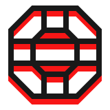

<div align='center'>
    <picture>
        <source media='(prefers-color-scheme: dark)' srcset='./.github/turntable-logo-light-160.png' />
        <source media='(prefers-color-scheme: light)' srcset='./.github/turntable-logo-dark-160.png' />
        
    </picture>
    <h1>⬡ Turntable</h1>
</div>


[](https://bundlephobia.com/result?p=@ghostship/core)
[](./docs/license)
[](https://github.com/unordinarity/malotru)
[](https://www.typescriptlang.org/)

Framework-agnostic flexible SPA router

# ⬡ Motivation/Promise

There are plenty of client-side routing libraries, but all of them aren't really lightweight and do not support middlewares or guards out-of-the-box

# ⬡ Features

- Expandable with [middlewares](./docs/middleware.md)
- Written in [TypeScript](https://github.com/microsoft/TypeScript)
- Zero-dependency
- Batteries included (in a separate [package](./packages/stdlib), but it's officially supported)
- Really lightweight [(<3kb min+gzip)](https://bundlephobia.com/result?p=@ghostship/core)

# ⬡ Installation

```shell
npm i @turntable/turntable @turntable/stdlib @turntable/react
```

```shell
yarn add @turntable/turntable @turntable/stdlib @turntable/react
```

```shell
pnpm add @turntable/turntable @turntable/stdlib @turntable/react
```

# ⬡ Usage/Utilizing/Enjoyment

```typescript jsx
import React from 'react'
import ReactDom from 'react-dom'
import { Ghostship } from '@ghostship/core'
import { GhostshipComponent } from '@ghostship/react'

import { HomePage, PostPage, NotFoundPage } from './components/pages'

const ghostship = new Ghostship(
  // routes tree
  [{
    path: '/',
    component: HomePage,
  }, {
    path: '/post/:slug',
    components: PostPage,
  }],
  // options
  {
    trailingSlash: true,
    notFound: NotFoundPage
  }
)

ReactDom.render(
  <GhostshipComponent instance={ghostship} />,
  document.getElementById('react')
)
```

# ⬡ API


# ⬡ Contribution

Feel free to open an issue/discussion with request/report, but ensure you read/follow [Contributor Covenant Code of Conduct](./docs/code_of_conduct.md)

# ⬡ Development/History

[Changelog/Past/Versions](./docs/changelog.md)

[Roadmap/Future](./docs/roadmap.md)

# ⬡ Legal info

Project licensed under [MIT License](./docs/license.md). [What it means](https://choosealicense.com/licenses/mit/)

# ⬡ Brand/Look

Project name, logo, visual design and writing style heavily inspired by [Control game](https://www.remedygames.com/games/control/) (made by [Remedy Entertainment](https://www.remedygames.com/))
